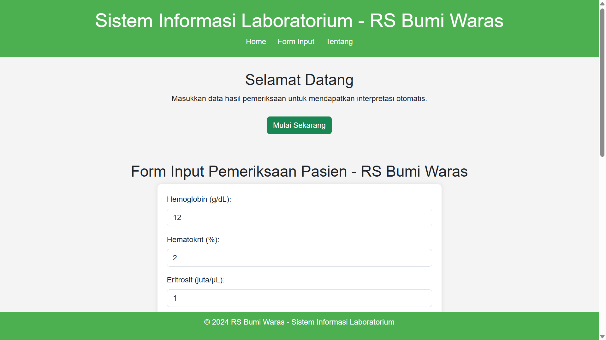
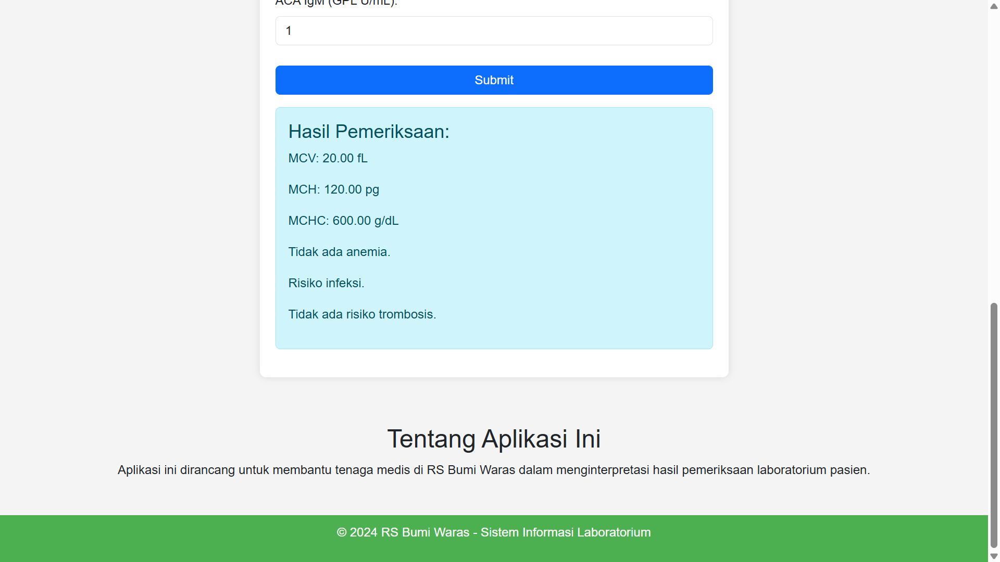

# Sistem Informasi Laboratorium - RS Bumi Waras

Aplikasi ini dirancang untuk membantu tenaga medis di RS Bumi Waras dalam menginterpretasi hasil pemeriksaan laboratorium pasien. 

## Fitur Utama
- Input data hasil pemeriksaan (Hemoglobin, Hematokrit, Eritrosit, Leukosit, ACA IgG, ACA IgM).
- Perhitungan otomatis nilai MCV, MCH, dan MCHC.
- Deteksi anemia, infeksi, dan risiko trombosis.

## Instalasi
1. Clone repository ini:
   ```bash
   git clone https://github.com/defanggaabypn/sil
   ```
2. Buka file `index.html` di browser.
3. Pastikan koneksi internet aktif untuk mendukung Bootstrap dan Font Awesome.

## Perhitungan
- **MCV (Mean Corpuscular Volume)**
  ```
  MCV = (Hematokrit * 10) / Eritrosit
  ```
- **MCH (Mean Corpuscular Hemoglobin)**
  ```
  MCH = (Hemoglobin * 10) / Eritrosit
  ```
- **MCHC (Mean Corpuscular Hemoglobin Concentration)**
  ```
  MCHC = (Hemoglobin / Hematokrit) * 100
  ```

## Contoh Hasil





## Lisensi
Aplikasi ini dibuat untuk keperluan edukasi dan pengembangan di RS Bumi Waras. Bebas digunakan dan dimodifikasi.

&copy; 2024 RS Bumi Waras

